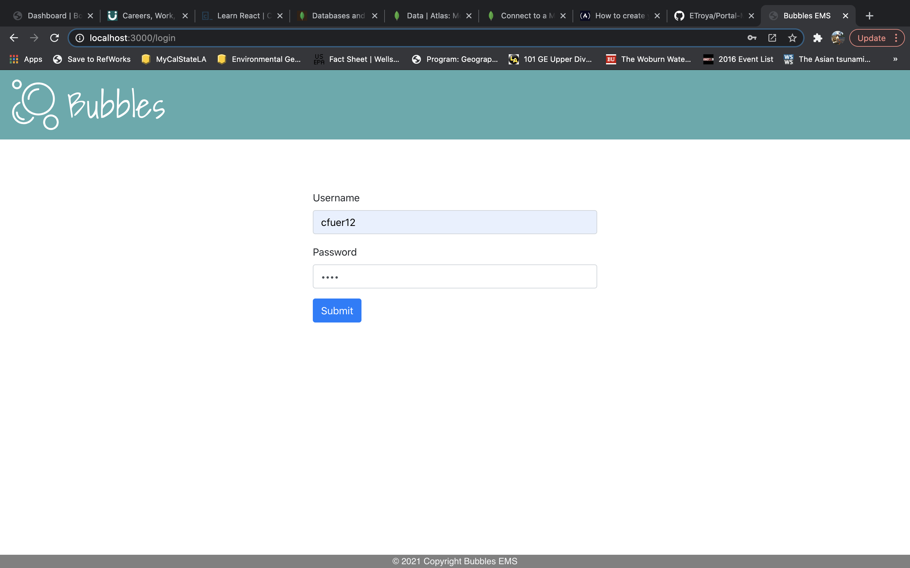
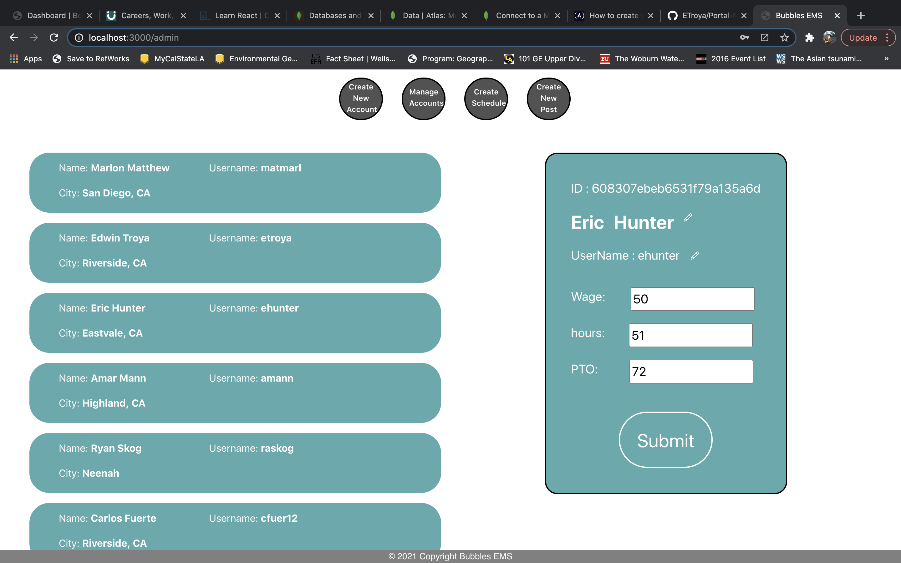

# Best Unlimited Business Building Leading Employment Services
Bubbles EMS (Employee Portal)

  * [User Story](#userstory)
  * [Description](#description)
  * [Project Status](#projectstatus)
  * [Usage](#usage)
  * [Tools](#tools)
  * [License](#license)
  * [Questions](#questions)
  * [Screenshots](#screenshots)

## User Story 
Bubbles EMS is a employee portal that gives smaller businesses/companies a chance to partake in having a employee protal for their business that they are trying to run. It gives the user a chance to create users for the EMS system in which these users can then login and view what time they will start work, view the message boards/news, comment on posts, check time, check pay, and check out the work directory. Bubbles EMS will also have an admin portal in which an admin will be able to create users, manage message boards, create schedules using a calender, and manage users accounts. Its a simple, user freindly way in which small companies/businesses can manage their employees. 

## Description
This app will let users and admins log into an employee portal in which they can manage their own proper accounts. All the info is stored into databases that is all connected with Bubbles EMS. Users will login into the web app thus pulling their stroed account info from Atlas DB. Now depending if the person will be a user or admin, the home screen will only show certain pages when logged into the web app. Admins will have more control with the pages, while users will only have certain pages like time, comments and pay to view on the app. All of the info is stored into two collections within the database, employee DB and message board DB. All of it is being saved and all of that information is then being pulled onto the website. 

## Project Status
This is a project for the UCR coding bootcamp. Development has slowed down due to time, but would eventually be picked up soon if a request is made for Bubbles EMS. 

## Usage
When terminal is open, the user will have to run "npm start" to start the web app in the broswer. Once its running, input the localhost web address into the browser and input into the information feilds and launch the web app. 

## Tools
MERN stack
-mongo
-express
-reactJS
-nodeJS

## License
MIT License

Copyright (c) 2021 Bubbles EMS

Permission is hereby granted, free of charge, to any person obtaining a copy
of this software and associated documentation files (the "Software"), to deal
in the Software without restriction, including without limitation the rights
to use, copy, modify, merge, publish, distribute, sublicense, and/or sell
copies of the Software, and to permit persons to whom the Software is
furnished to do so, subject to the following conditions:

The above copyright notice and this permission notice shall be included in all
copies or substantial portions of the Software.

THE SOFTWARE IS PROVIDED "AS IS", WITHOUT WARRANTY OF ANY KIND, EXPRESS OR
IMPLIED, INCLUDING BUT NOT LIMITED TO THE WARRANTIES OF MERCHANTABILITY,
FITNESS FOR A PARTICULAR PURPOSE AND NONINFRINGEMENT. IN NO EVENT SHALL THE
AUTHORS OR COPYRIGHT HOLDERS BE LIABLE FOR ANY CLAIM, DAMAGES OR OTHER
LIABILITY, WHETHER IN AN ACTION OF CONTRACT, TORT OR OTHERWISE, ARISING FROM,
OUT OF OR IN CONNECTION WITH THE SOFTWARE OR THE USE OR OTHER DEALINGS IN THE
SOFTWARE.

## Questions
For any questions or concerns, please contact us on our GitHubs!
-[Eric Hunter](https://github.com/ehunter7)
-[Edwin Troya](https://github.com/ETroya)
-[Carlos Fuerte](https://github.com/cfuer12)
-[Marlon Matthew](https://github.com/marlonmatthew)
-[Amar Mann](https://github.com/amarmann92) 

## ScreenShot

